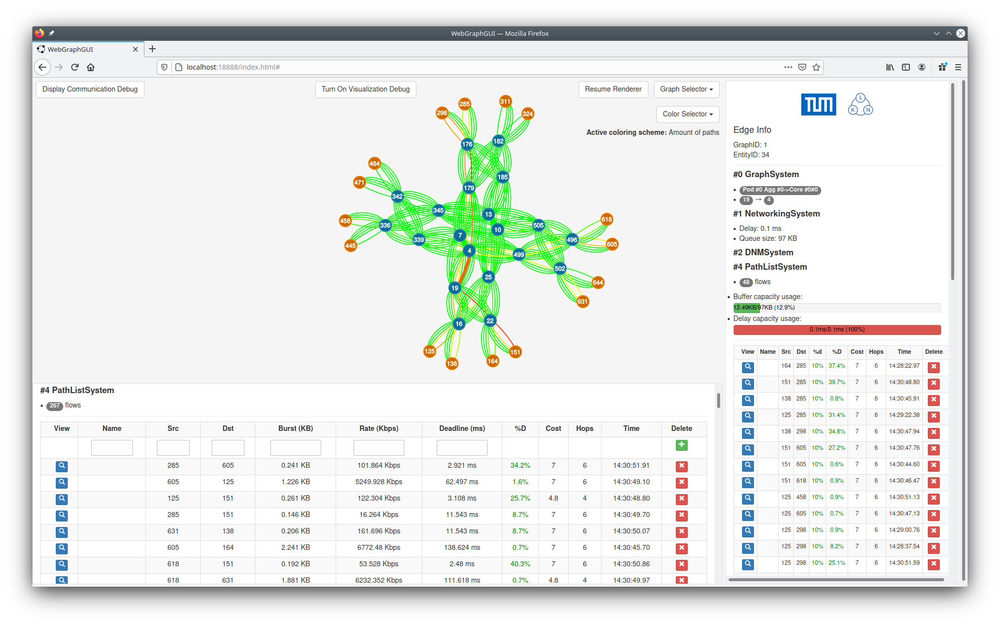

# Web Graph GUI

A Javascript web interface allowing to visualize the [graphs](https://github.com/AmoVanB/eces-graph) of a [network](https://github.com/AmoVanB/eces-network) within the [ECES](https://github.com/AmoVanB/eces-core) ecosystem.
(The code is currently dirty and messy and should be refactored, but it works).

The image below shows an example of the GUI running and displaying a fat tree topology.
The queues in the network are colored according to the number of flows that are embedded at each queue (red being for the most number of flows).
The right pane shows the flows embedded in the highlighted queue, the lower pane shows all the flows in the network.

<p align="center">

</p>

## Usage

The project can be downloaded from maven central using:
```xml
<dependency>
  <groupId>de.tum.ei.lkn.eces</groupId>
  <artifactId>webgraphgui</artifactId>
  <version>X.Y.Z</version>
</dependency>
```

The following snippet shows an example of how to start the interface to show a network:

```java
// ECES, Network and DNM inits
Controller controller = new Controller();
NetworkingSystem myNetworkingSystem = new NetworkingSystem(controller);
RoutingSystem routingSystem = new RoutingSystem(controller);
DetServConfig cfg = new DetServConfig(ACModel.TBM,
        ResidualMode.HIGHEST_SLOPE,
        BurstIncreaseModel.WORST_CASE_BURST_REAL_RESERVATION,
        false,
        new LowerLimit(new UpperLimit(
                new Summation(
                        new Constant(),
                        new Division(
                                new Constant(), new Constant(2))),
                2), 1),
        (cont, sched) -> new TBMDelayRatiosAllocation(cont));
new DNMSystem(controller);
cfg.initCostModel(controller);
LARACAlgorithm dclcAlgorithm = new LARACAlgorithm(controller);
dclcAlgorithm.setProxy(new DetServProxy(controller));

// GUI
ColoringSystem myColoringSys = new ColoringSystem(controller);
myColoringSys.addColoringScheme(new DelayColoring(controller), "Delay");
myColoringSys.addColoringScheme(new QueueColoring(controller), "Queue sizes");
myColoringSys.addColoringScheme(new RateColoring(controller), "Link rate");
myColoringSys.addColoringScheme(new RemainingRateColoring(controller), "Remaining rate");
myColoringSys.addColoringScheme(new AssignedRateColoring(controller), "Assigned rate");
myColoringSys.addColoringScheme(new RemainingBufferColoring(controller), "Remaining buffer space");
myColoringSys.addColoringScheme(new RemainingDelayColoring(controller), "Remaining delay");
myColoringSys.addColoringScheme(new AssignedBufferColoring(controller), "Assigned buffer space");
myColoringSys.addColoringScheme(new LastEmbeddingColoring(new PathListSystem(controller)), "Last embedded flow");
myColoringSys.addColoringScheme(new PathListColoring(controller), "Amount of paths");
new WebGraphGuiSystem(controller, myColoringSys, 8080);
```

The GUI automatically discovers and displays the systems registered to the same `controller`.

See [tests](src/test) and the [Chameleon network controller](https://github.com/AmoVanB/chameleon-controller) for other examples of how to start the interface.
